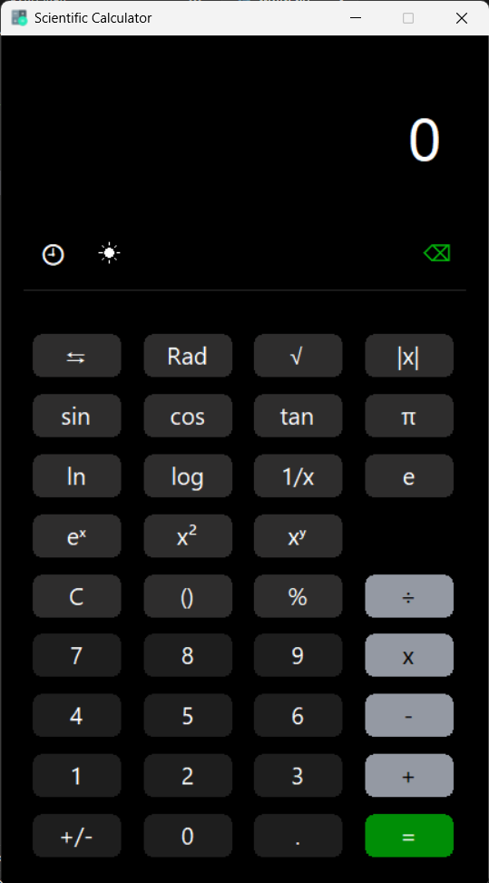
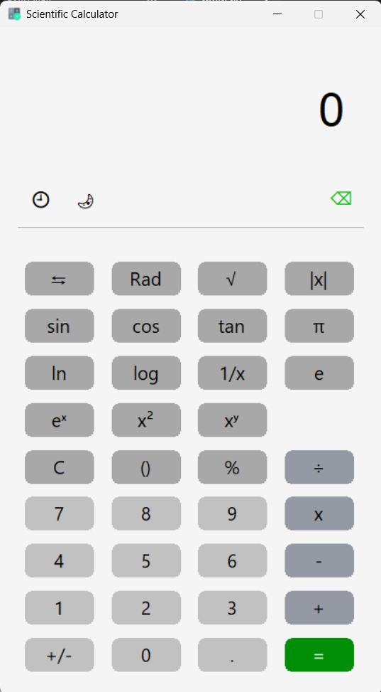

# 🧮 Scientific Calculator using Python Tkinter

A modern **Scientific Calculator GUI Application** built using **Python** and **Tkinter** with advanced scientific operations, elegant rounded-button interface, dark/light theme switching, keyboard support, expression history, and interactive UI effects.

---

# 📌 Project Overview

This project is a fully functional desktop-based scientific calculator designed with a modern custom graphical interface instead of traditional Tkinter buttons.

The calculator supports:

* Basic arithmetic operations
* Advanced scientific functions
* Trigonometric calculations
* Hyperbolic functions
* Inverse trigonometric operations
* Dynamic scientific mode switching
* Expression history panel
* Keyboard input support
* Dark/Light theme system
* Custom rounded GUI buttons
* Responsive press animations

---

# ✨ Main Features

## ✅ Modern GUI System

* Custom rounded buttons using `Canvas`
* Clean scientific calculator layout
* Professional dark theme UI
* Smooth button press/release effects
* Dynamic color handling

---

## ✅ Scientific Operations

### Basic Operations

* Addition `+`
* Subtraction `-`
* Multiplication `×`
* Division `÷`
* Percentage `%`
* Positive/Negative toggle `+/-`

---

### Advanced Scientific Functions

* Square root `√`
* Cube root `∛`
* Power functions `x²`, `x³`, `xʸ`
* Exponential functions `eˣ`, `2ˣ`
* Reciprocal `1/x`
* Absolute value `|x|`
* Factorial `x!`

---

### Trigonometric Functions

* `sin`
* `cos`
* `tan`

### Inverse Trigonometric Functions

* `sin⁻¹`
* `cos⁻¹`
* `tan⁻¹`

---

### Hyperbolic Functions

* `sinh`
* `cosh`
* `tanh`

### Inverse Hyperbolic Functions

* `sinh⁻¹`
* `cosh⁻¹`
* `tanh⁻¹`

---

### Logarithmic Functions

* Natural logarithm `ln`
* Common logarithm `log`

---

### Constants

* π (Pi)
* e (Euler Number)

---

# 🌗 Theme Management System

The calculator includes a complete **Dark ↔ Light mode toggle system**.

### Features

* Real-time theme switching
* Automatic widget recoloring
* Adaptive button text colors
* Modern UI appearance

Implemented using:

```python
ThemeManager.toggle_theme(self)
```

---

# 🕘 History Panel System

A dedicated history manager stores previously solved expressions.

### Features

* View past calculations
* Toggle history visibility
* Clear complete history
* Separate history panel module

Implemented using:

```python
HistoryPanel.show_history(self)
```

---

# ⌨️ Keyboard Support

The calculator supports direct keyboard interaction.

### Supported Inputs

* Numbers
* Operators
* Enter key
* Backspace
* Decimal operations

Implemented using:

```python
self.bind("<Key>", lambda event: ButtonOperations.key_press(self, event))
```

---

# 🔄 Dynamic Scientific Mode

The calculator can dynamically switch between:

### Primary Functions

```text
√, sin, cos, tan, ln, log, eˣ, x²
```

### Secondary Functions

```text
∛, sinh, cosh, tanh, x!, x³
```

Implemented using:

```python
toggle_second_function()
```

---

# 🎨 Custom GUI Architecture

Instead of using traditional Tkinter buttons, this project uses:

```python
tk.Canvas()
```

to create:

* Rounded buttons
* Custom animations
* Advanced styling
* Better modern appearance

### Rounded Rectangle Rendering

```python
create_rounded_rect()
```

This allows:

* Smooth corners
* Better UI aesthetics
* Professional calculator appearance

---

# 🧠 Object-Oriented Design

The project follows modular OOP architecture.

## Main Components

| File                  | Responsibility                       |
| --------------------- | ------------------------------------ |
| `main.py`             | Main application GUI                 |
| `button_operation.py` | Expression handling and calculations |
| `history_panel.py`    | History management system            |
| `darkToLight.py`      | Theme switching logic                |

---

# 📂 Project Structure

```bash
1. Calculator/
│
├── images/
├── main.py
├── button_operation.py
├── history_panel.py
├── darkToLight.py
├── calculator.ico
└── README.md
```

---

# 🚀 Technologies Used

* Python 3
* Tkinter GUI Library
* Object-Oriented Programming
* Canvas Graphics System

---

# 🖥️ GUI Highlights

## Interface Features

* Responsive layout
* Scientific keypad design
* Rounded modern buttons
* Minimalist appearance
* High contrast readability
* Animated press effects

---

# ⚡ Performance Features

* Lightweight application
* Fast expression evaluation
* Efficient event handling
* Minimal memory usage

---

# 🔒 Error Handling

The calculator is designed to safely handle:

* Invalid expressions
* Divide-by-zero errors
* Incorrect function usage
* Input formatting problems

---

# 📸 Suggested Screenshots

You can add screenshots here:

```markdown


```

---

# ▶️ How to Run

## 1️⃣ Clone Repository

```bash
git clone https://github.com/Soumodip-05/1. Calculator.git
```

## 2️⃣ Open Project Folder

```bash
cd 1. Calculator
```

## 3️⃣ Run Application

```bash
python main.py
```

---

# 📈 Future Improvements

Possible future upgrades:

* Graph plotting
* Matrix calculations
* Equation solver
* Unit converter
* Complex number support
* Memory registers
* Voice input
* Custom themes

---

# 👨‍💻 Author

Developed by **Soumodip Majumdar**

---

# ⭐ Support

If you like this project:

* Star the repository
* Fork the project
* Contribute improvements

---

# 📜 License

This project is open-source and available under the MIT License.
