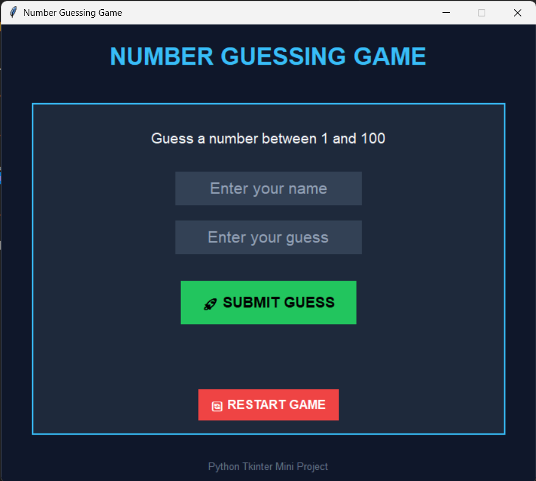

# 🎯 Number Guessing Game

A modern and interactive **Number Guessing Game** built using **Python** and **Tkinter** with a futuristic neon-themed GUI, smooth hover effects, restart system, dynamic messages, placeholder entries, and responsive game logic.

---

# 📌 Project Overview

This project is a desktop-based GUI game where the player must guess a randomly generated number between **1 and 100** within limited attempts.

The game provides:

* Real-time hints
* Attempt tracking
* Restart functionality
* Modern UI design
* Neon-themed interface
* Interactive buttons
* Placeholder input system

---

# ✨ Main Features

## ✅ Modern GUI Design

* Futuristic neon UI
* Dark-themed interface
* Responsive layout
* Stylish game card system
* Clean typography

---

## ✅ Random Number Generation

The game automatically generates:

```python id="wkh4qv"
random.randint(1, 100)
```

Every restart creates a completely new challenge.

---

## ✅ Smart Hint System

The game gives intelligent feedback:

* 📈 Too High
* 📉 Too Low
* 🎉 Correct Guess
* 💀 Game Over

This improves user interaction and gameplay experience.

---

# 🎮 Gameplay Features

## ✅ Limited Attempts System

* Total attempts: **7**
* Countdown tracking
* Real-time remaining chances display

---

## ✅ Restart Game System

Players can instantly restart the game using:

```python id="4vgh4n"
restart_game()
```

The restart system:

* Generates new number
* Resets attempts
* Clears inputs
* Restores placeholders
* Displays new game message

---

# 🎨 GUI System Highlights

## 🌌 Neon Cyberpunk Theme

The interface uses modern neon colors:

| Purpose        | Color      |
| -------------- | ---------- |
| Background     | Dark Navy  |
| Primary Accent | Neon Blue  |
| Success        | Neon Green |
| Danger         | Neon Red   |

---

## ✅ Custom Styled Components

### Input Fields

* Center aligned text
* Placeholder system
* Modern flat design
* Neon styling

### Buttons

* Hover animations
* Flat modern appearance
* Interactive feedback
* Cursor effects

---

# 🖱️ Hover Animation System

Interactive hover effects improve UI experience.

### Submit Button Hover

```python id="4zjweq"
submit_btn.bind("<Enter>", on_enter)
submit_btn.bind("<Leave>", on_leave)
```

### Restart Button Hover

```python id="l8w9u0"
restart_btn.bind("<Enter>", restart_enter)
restart_btn.bind("<Leave>", restart_leave)
```

---

# 🧠 Placeholder Input System

Custom placeholder functionality is implemented manually using:

```python id="zydu38"
add_placeholder()
```

### Features

* Auto placeholder insertion
* Focus detection
* Dynamic text color changes
* Better user experience

---

# 🏗️ GUI Architecture

The project is built using:

```python id="q5b9vc"
Tkinter
```

Main GUI Components:

* `Tk()`
* `Frame`
* `Label`
* `Entry`
* `Button`
* `StringVar`

---

# ⚡ Important Functionalities

## ✅ Input Validation

The program safely handles invalid input:

```python id="v5o6ps"
try:
    guess = int(guess_var.get())
except:
```

This prevents crashes from non-numeric values.

---

## ✅ Dynamic Message System

Messages update instantly using:

```python id="zscjq9"
message_var.set()
```

---

## ✅ Responsive Layout

The interface uses:

* `pack()`
* Dynamic padding
* Expandable card layout

for a clean and centered UI.

---

# 📂 Project Structure

```bash id="0i1h7n"
2. Random-number-Guessing-Game/
│
├── GUI-based-Guessing-game.py
├── README.md
└── screenshots/
```

---

# 📸 Application Preview

<p align="center">
  
</p>

---

# 🚀 Technologies Used

* Python 3
* Tkinter GUI Library
* Random Module
* Event Handling
* GUI Animations

---

# ▶️ How to Run

## 1️⃣ Clone Repository

```bash id="2iyx57"
git clone https://github.com/Soumodip-05/2. Random-number-Guessing-Game.git
```

## 2️⃣ Open Project Folder

```bash id="1jj7qo"
cd 2. Random-number-Guessing-Game
```

## 3️⃣ Run the Program

```bash id="0p4jqm"
python GUI-based-Guessing-game.py
```

---

# 🔥 Game Flow

1. Enter your name
2. Guess a number between 1–100
3. Receive hints
4. Win before attempts finish
5. Restart and play again

---

# 🛡️ Error Handling

The game safely handles:

* Empty inputs
* Invalid numbers
* Incorrect data types
* Multiple restarts

---

# 🌟 Future Improvements

Possible future upgrades:

* Difficulty levels
* Sound effects
* Scoreboard system
* Timer mode
* Multiplayer mode
* Leaderboard
* Animated transitions

---

# 👨‍💻 Author

Developed by **Soumodip Majumdar**

---

# ⭐ Support

If you like this project:

* Star the repository
* Fork the project
* Share feedback
* Contribute improvements

---

# 📜 License

This project is open-source and available under the MIT License.
